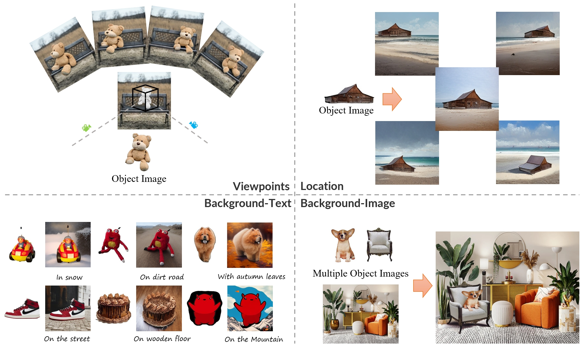
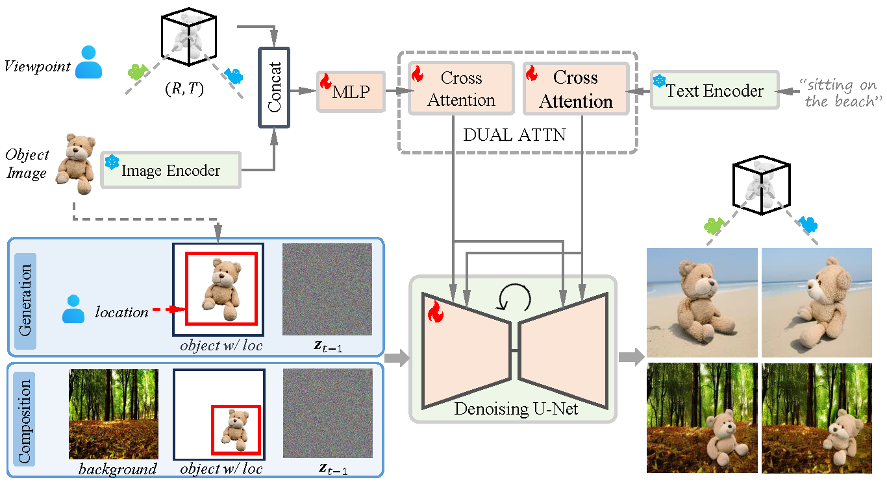

# CustomNet


Official implementation of CustomNet: Zero-shot Object Customization with Variable-Viewpoints in Text-to-Image Diffusion Models.

<div align="center">
  
</div>


## Introduce
Incorporating a customized object into image generation presents an attractive
feature in text-to-image generation. However, existing optimization-based and
encoder-based methods are hindered by drawbacks such as time-consuming optimization,
insufficient identity preservation, and a prevalent copy-pasting effect. To
overcome these limitations, we introduce CustomNet, a novel object customization
approach that explicitly incorporates 3D novel view synthesis capabilities
into the object customization process. This integration facilitates the adjustment
of spatial position relationships and viewpoints, yielding diverse outputs while effectively
preserving object identity. Moreover, we introduce delicate designs to
enable location control and flexible background control through textual descriptions
or specific user-defined images, overcoming the limitations of existing 3D
novel view synthesis methods. We further leverage a dataset construction pipeline
that can better handle real-world objects and complex backgrounds. Equipped
with these designs, our method facilitates zero-shot object customization without
test-time optimization, offering simultaneous control over the viewpoints, location,
and background. As a result, our CustomNet ensures enhanced identity
preservation and generates diverse, harmonious outputs.


<div align="center">
  
</div>


## BibTeX
```
@misc{yuan2023customnet,
    title={CustomNet: Zero-shot Object Customization with Variable-Viewpoints in Text-to-Image Diffusion Models}, 
    author={Ziyang Yuan and Mingdeng Cao and Xintao Wang and Zhongang Qi and Chun Yuan and Ying Shan},
    year={2023},
    eprint={2310.19784},
    archivePrefix={arXiv},
    primaryClass={cs.CV}
}
```
